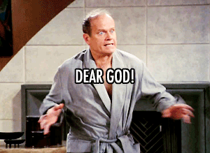

# Frasier Crane Transcript Analysis

A working analysis of the television show Frasier Crane, presented in two
acts.

* [ACT ONE: In A Sentimental Mood](analysis/actI.md)
* [ACT TWO: E Tu Eddie?](analysis/actII.md)

## Current Iteration

Currently this analysis includes three sections, a subtitle analysis,
an analysis of characters lines and a kitchen sink analysis of things
fans of Frasier might be interested in.

The good news is that there is a ton of data here. It includes ratings
and votings from IMDB. You might run correlations between characters
and ratings. You might want to run correlations on characters sentiments
and IMDB ratings as well.

## Thanks

I'd like to thank:

* The people who built the [kacl780.net](http://www.kacl780.net)
* Github user [@necrko](https://github.com/neckro/frasier) who scraped the KACL site
* Julia Silge & David Robinson for their creation of the [`tidytext`](https://www.tidytextmining.com/) package.
* Github user [@fkeck](https://github.com/fkeck/subtools) for the `subtools` package.

## Other notes
The data is available in this repo, as well as on [data.word](https://data.world/chipoglesby/frasier-crane-television-transcripts). 
There's more work that I would like to do to augment the transcript data in the future. I'd like to include
more scene information and who the charactcter is speaking to.
