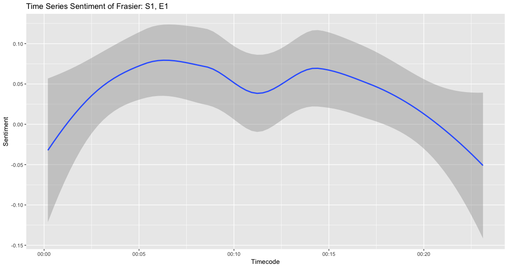

Chip Oglesby
2018-04-20

ACT ONE: IN A SENTIMENTAL MOOD

To begin our analysis, we will import all of the subtitles for the
television show Frasier. This includes 11 seasons and 264 episodes.

After importing the files usings the
[`subtools`](https://github.com/fkeck/subtools) package we will agument
our data with information from `IMDB.com`.

We are using the `tidytext` package to perform a sentiment analysis on
the subtitles.

Let’s get started:

    tidySubtitles <- subtitles %>%
      unnest_tokens(word, text) %>%
      anti_join(stop_words)

First we’ll unnest all of the words in our data frame and create tokens
for each word using the code above.

Let’s look at the top ten words across all 11 seasons:

``` r
tidySubtitles %>%
  filter(!grepl('frasier|roz|daphne|martin|niles|dad|crane|dr', word)) %>%
  count(word, sort = TRUE) %>%
  top_n(10, n) %>%
  knitr::kable()
```

| word   |    n |
| :----- | ---: |
| time   | 1709 |
| yeah   | 1696 |
| uh     | 1282 |
| hey    | 1238 |
| god    | 1050 |
| love   |  921 |
| night  |  868 |
| gonna  |  777 |
| people |  757 |
| call   |  743 |

After excluding some of the more common character names, this is our top
ten list. We would expect words like time and call since Frasier’s job
is a radio host.

I also suspect that “God” is commonly used by Frasier as one of his
catch phrases “Oh My God\!”

We’ll know for sure once we’ve analyzed the transcripts, but let’s take
a peek:

| text           |  n |
| :------------- | -: |
| oh, my god     | 65 |
| oh, dear god   | 44 |
| oh, god        | 18 |
| dear god       | 12 |
| for god’s sake |  7 |

Adding the [`Bing`](https://www.tidytextmining.com/sentiment.html)
lexicon for sentiment analysis, we can then begin to get a picture of
what some of the sentiment includes. Let’s take another look:

| word      | sentiment |   n |
| :-------- | :-------- | --: |
| love      | positive  | 921 |
| nice      | positive  | 678 |
| fine      | positive  | 505 |
| excuse    | negative  | 440 |
| bad       | negative  | 433 |
| happy     | positive  | 373 |
| wrong     | negative  | 370 |
| hell      | negative  | 322 |
| ready     | positive  | 301 |
| wonderful | positive  | 285 |

Now that we’ve labled words into a binary fashion, `positive` or
`negative` we can take this data and create an algorithm that will help
us plot this information for a time-series analysis.

To do that, I will create new variables called `dateTimeIn` and
`dateTimeOut`.

We can do this by using `dplyr` to mutate the information we have.

    subtitles %<>%
    mutate(dateTimeIn = ymd_hms(paste0(originalAirDate, timecodeIn)),
           dateTimeOut = ymd_hms(paste0(originalAirDate, timecodeOut))

This will take our date, 1993-09-16 and our timecodeOut, 00:00:11.951
and give us 1993-09-16 00:00:11, which we can then use to plot our data
for any episode and season.


In this graph, I’m using an algorithm that creates a minute difference
between the first and last timestamp of each episode and then calcuates
the polarity of words being spoken during each minute with `sentiment =
positive - negative` word counts.

Now we have our first visualization at the sentiment of words during
each minute of the show.

While the individual sentiment analysis of a word is interesting, what
would be more interesting is the analysis of each sentence overall.

To help with this, we’ll use the `sentimentr` [package on
Github](https://github.com/trinker/sentimentr).

Now we can use the code below to get the over all average sentiment of
each sentence which will give us a better calculation for sentiment than
just single words.

``` r
subtitles %>%
  filter(season == 1) %>%
  mutate(sentences = get_sentences(text)) %$%
  sentiment_by(sentences, list(season, episode)) %>%
  knitr::kable()
```

| season | episode | word\_count |        sd | ave\_sentiment |
| -----: | ------: | ----------: | --------: | -------------: |
|      1 |       1 |        2641 | 0.2287571 |      0.0800368 |
|      1 |       2 |        2865 | 0.2669024 |      0.1006411 |
|      1 |       3 |        3303 | 0.2757897 |      0.1439134 |
|      1 |       4 |        3325 | 0.2516266 |      0.0938251 |
|      1 |       5 |        3413 | 0.2083973 |      0.1313697 |
|      1 |       6 |        2428 | 0.2589560 |      0.1046161 |
|      1 |       7 |        2474 | 0.2378644 |      0.0984380 |
|      1 |       8 |        2535 | 0.2793574 |      0.1045188 |
|      1 |       9 |        2584 | 0.2901932 |      0.0565543 |
|      1 |      10 |        2264 | 0.2871554 |      0.1395152 |
|      1 |      11 |        2323 | 0.2563188 |      0.0648546 |
|      1 |      12 |        2379 | 0.2799138 |      0.1633886 |
|      1 |      13 |        2495 | 0.2807880 |      0.1651235 |
|      1 |      14 |        2298 | 0.2208333 |      0.1052322 |
|      1 |      15 |        2584 | 0.2901932 |      0.0565543 |
|      1 |      16 |        2264 | 0.2871554 |      0.1395152 |
|      1 |      17 |        2401 | 0.2736018 |      0.1394788 |
|      1 |      18 |        2379 | 0.2799138 |      0.1633886 |
|      1 |      19 |        2656 | 0.2630231 |      0.0768660 |
|      1 |      20 |        2616 | 0.2441385 |      0.1279380 |
|      1 |      21 |        2586 | 0.2469800 |      0.1052640 |
|      1 |      22 |        2508 | 0.2496631 |      0.1098577 |
|      1 |      23 |        2694 | 0.2813022 |      0.1024440 |
|      1 |      24 |        2724 | 0.2433418 |      0.1175034 |

When we break it out by minute, we can graph the average sentiment per
minute:


