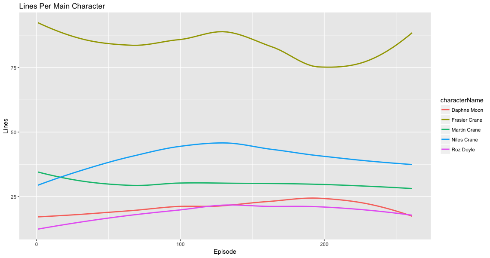
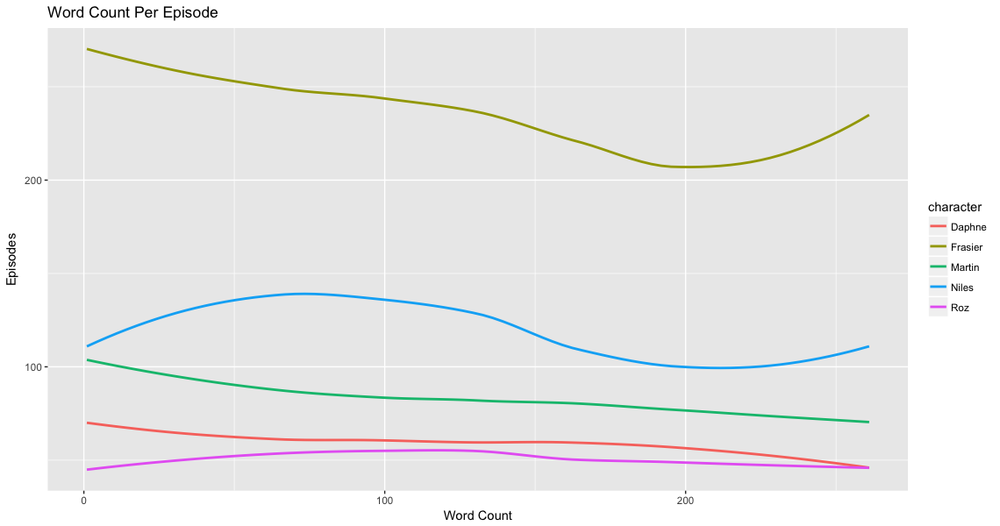

E Tu Eddie?
================
Chip Oglesby
2018-05-02

In this part of our analysis we will take a deeper dive of the television show Frasier.

If you've seen Frasier before, you know the the show is led by main characters: Frasier Crane, is brother Niles Crane, his father Martin Crane, his father's caregiver and Niles' future wife, Daphne Crane and Frasier's coworker Roz Doyle.

Let's begin by taking a look at the line share of these main characters:

Overall Frasier Crane carries 34.01% of all lines, almost twice as many as any other character on the show.

The line share of characters outside of the main five continued to grow throughout the entire 11 seasons.

Since Frasier is the main character of the show and we've already seen that he has the most lines of the show, does it make sense that he would also have the most words per episode as well?

 Like with the subtitle analysis, we'll also dive into a unigram sentiment analysis to see which characters use the most positive and negative words in each episode.

It's interesting to see that Niles and Frasier follow a similiar linear trend in the sentiment of their words. Frasier's largest use of negative words comes in episode 90: Ham Radio where he directs an old-timey radio show that turns into a disaster, while his largest uses of positive words comes in episode 214: The Ring Cycle where Daphne and Niles elope in Las Vegas and then stage a series of fake weddings.

Average Word Length
-------------------

Another way that we may judge our characters is to look at the average length of words that they use:

| characterName |  meanLetterPerWord|
|:--------------|------------------:|
| Niles Crane   |           4.121495|
| Frasier Crane |           4.055633|
| Roz Doyle     |           3.978286|
| Daphne Moon   |           3.977670|
| Martin Crane  |           3.927662|

Here we can see that Niles Crane comes in first with an average of 4.12 characters per word, followed by Frasier Crane and Martin Crane coming in last. Martin Crane uses more words like **ain't** instead of some of the more high-brow words like Niles Crane.

Is Frasier the star of his own show?
------------------------------------

We know from previous charts that Frasier carries the majority of the dialouge across the entire show, but is he the most mentioned? For that let's turn back to our `tidytext` analysis.

| word    |  count|
|:--------|------:|
| niles   |   2757|
| martin  |   2486|
| frasier |   1862|
| roz     |   1554|
| daphne  |   1292|

That's interesting that Niles would rank above Frasier in overall mentions. Let's look into who is mentioning whom between main characters.

| character |  daphne|  frasier|  martin|  niles|   roz|
|:----------|-------:|--------:|-------:|------:|-----:|
| Frasier   |     594|        0|    1760|   2111|  1284|
| Martin    |     133|      445|       0|    351|    80|
| Daphne    |       0|       38|      39|    177|    78|
| Roz       |      81|      512|      75|    118|     0|
| Niles     |     484|      867|     612|      0|   112|

Here we find that Fraiser has mentioned Niles 2111 times compared Niles' mentions of Frasier at 867. The data for Daphne is a bit skewed since she refers to both brothers as Dr. Crane for many of the episodes. I've also removed self-references from main characters.

Top Positive & Negative Words
-----------------------------

Most Distinguishing Words For Main Characters
---------------------------------------------

| character | word    |  uniquenessOfWord|
|:----------|:--------|-----------------:|
| Daphne    | crane   |         1943.0577|
| Daphne    | dr      |         1857.6753|
| Daphne    | mum     |          479.5264|
| Daphne    | bloody  |          238.4252|
| Daphne    | nice    |          168.8845|
| Frasier   | niles   |         4413.9584|
| Frasier   | dad     |         3442.1692|
| Frasier   | roz     |         2905.5846|
| Frasier   | god     |         1102.0595|
| Frasier   | time    |          861.8832|
| Martin    | yeah    |         2141.1908|
| Martin    | hey     |         1785.0858|
| Martin    | fras    |          853.3099|
| Martin    | eddie   |          770.8073|
| Martin    | guys    |          625.8700|
| Niles     | frasier |         1445.4581|
| Niles     | maris   |          762.1647|
| Niles     | wait    |          227.8986|
| Niles     | mel     |          136.2381|
| Niles     | maris's |          120.6549|
| Roz       | alice   |          348.1129|
| Roz       | line    |          217.9855|
| Roz       | martin  |          135.2960|
| Roz       | roger   |          125.1669|
| Roz       | weird   |          102.8421|
