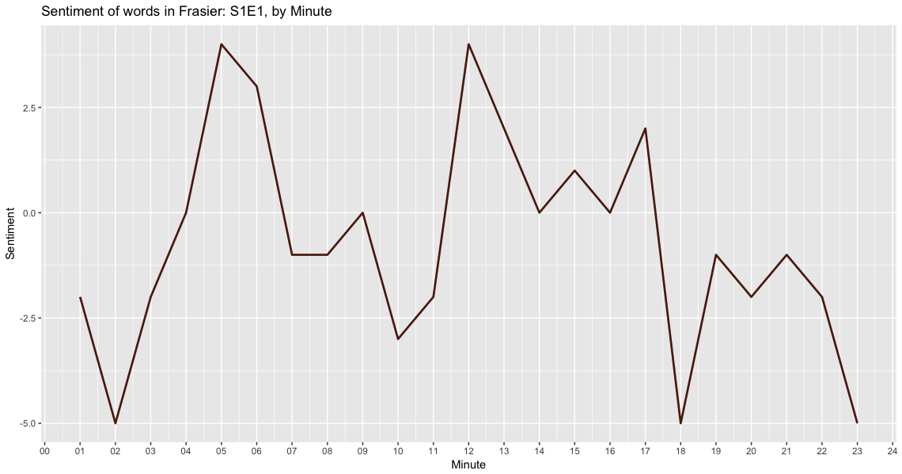

ACT ONE: IN A SENTIMENTAL MOOD

To begin our analysis, we will import all of the subtitles for the television show Frasier. This includes
`r length(unique(subtitles$season))` seasons and
`r length(unique(subtitles$episode)) * length(unique(subtitles$season))`
episodes.

After importing the files usings the [`subtools`](https://github.com/fkeck/subtools) package we will agument our data with information from `IMDB.com`.

We are using the `tidytext` package to perform a sentiment
analysis on the subtitles.

Let's get started:
```
tidySubtitles <- subtitles %>%
  unnest_tokens(word, text) %>%
  anti_join(stop_words)
```

First we'll unnest all of the words in our data frame and create tokens
for each word using the code above.

Let's look at the top ten words across all 11 seasons:

```{r echo = TRUE, message = FALSE, warning = FALSE}
tidySubtitles %>%
  filter(!grepl('frasier|roz|daphne|martin|niles|dad|crane|dr', word)) %>%
  count(word, sort = TRUE) %>%
  top_n(10, n) %>%
  knitr::kable()
```

After excluding some of the more common character names, this is our top
ten list. We would expect words like time and call since Frasier's
job is a radio host.

I also suspect that "God" is commonly used by Frasier as
one of his catch phrases "Oh My God!"

We'll know for sure once we've analyzed the transcripts, but let's take a peek:

```{r echo = FALSE, warnings = FALSE}
subtitles %>%
  filter(grepl('god', tolower(text))) %>%
  count(text, sort = TRUE) %>%
  top_n(5, n) %>%
  knitr::kable()
```


Adding the [`Bing`](https://www.tidytextmining.com/sentiment.html) lexicon for sentiment analysis, we can then begin to get a
picture of what some of the sentiment includes. Let's take another look:

```{r echo = FALSE, message = FALSE, warning = FALSE}
top10Subtitles %>%
  knitr::kable()
```

Now that we've labled words into a binary fashion, `positive` or `negative` we
can take this data and create an algorithm that will help us plot this
information for a time-series analysis.

To do that, I will create new variables called `dateTimeIn` and `dateTimeOut`.

We can do this by using `dplyr` to mutate the information we have.

```
subtitles %<>%
mutate(dateTimeIn = ymd_hms(paste0(originalAirDate, timecodeIn)),
       dateTimeOut = ymd_hms(paste0(originalAirDate, timecodeOut))
```

This will take our date, `r subtitles$originalAirDate[[1]]` and our timecodeOut, `r subtitles$timecodeOut[[1]]`
and give us `r subtitles$dateTimeOut[[1]]`, which we can then use to plot our
data for any episode and season.



In this graph, I'm using an algorithm that creates a minute difference between
the first and last timestamp of each episode and then calcuates the polarity of
words being spoken during each minute with `sentiment = positive - negative` word
counts.

Now we have our first visualization at the sentiment of words during each minute of the show.

While the individual sentiment analysis of a word is interesting, what
would be more interesting is the analysis of each sentence overall.

To help with this, we'll use the `sentimentr` [package on Github](https://github.com/trinker/sentimentr).

Now we can use the code below to get the over all average sentiment
of each sentence which will give us a better calculation for sentiment
than just single words.

```{r echo = TRUE, warning = FALSE}
subtitles %>%
  filter(season == 1) %>%
  mutate(sentences = get_sentences(text)) %$%
  sentiment_by(sentences, list(season, episode)) %>%
  knitr::kable()
```

When we break it out by minute, we can graph the average sentiment
per minute:


## Term Frequency

Now let's look at the term frequency inverse document frequency or `TF-IDF` of the words in our analysis. `TF-IDF` is the frequency for how rarely a word is used and measures how important a word is in a corpus.

```{r echo = TRUE, warning = FALSE, message = FALSE}
tidySubtitles %>% 
  count(season, word, sort = TRUE) %>%
  group_by(season) %>% 
  mutate(total = sum(n),
         nTotal = n/total) %>%
  ungroup() %>% 
  top_n(10, n) %>% 
  knitr::kable()
```


From the chart we can see that the data is highly right skewed with more
common words. Many of the words occur frequently and some rarely occur.

What could some of those words be?


In our next analysis, we'll be digging into the transcripts to get
a better idea of who's saying what and more exciting work!

I'd like to thank [Pachá](http://pacha.hk/2018/04/11/archer-and-tidy-data-principles-part-2/) for sharing their code that allowed me to create
the charts for the TF-IDF work.