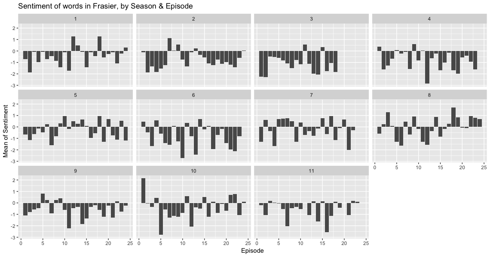

ACT ONE: IN A SENTIMENTAL MOOD

To begin our analysis, we will import all of the subtitles from
the internet for the television show Frasier. This includes
`r length(unique(subtitles$season))` seasons and
`r length(unique(subtitles$episode)) * length(unique(subtitles$season))`
episodes.

To begin the analysis of subtitle information, the first thing that we need
to do is to clean and merge data from `IMDB.com` and our subtitle files.

I will be creating new variables called `dateTimeIn` and `dateTimeOut`.

We can do this by using `dplyr` to mutate the information we have.

```
subtitles %<>%
mutate(dateTimeIn = ymd_hms(paste0(originalAirDate, timecodeIn)),
       dateTimeOut = ymd_hms(paste0(originalAirDate, timecodeOut))
```

This will take our date, `"1993-09-16"` and our timecodeOut, `"00:00:11"`
and give us `"1993-09-16 00:00:11 UTC"`, which we can then use to plot our
data.

Additionally, we are using the `tidytext` package to perform an individual
analysis on the subtitles. Let's take a look at some of our data:

```
tidySubtitles <- subtitles %>% 
  unnest_tokens(word, text) %>% 
  anti_join(stop_words)
```

First we'll unnest all of the words in our data frame and create tokens
for each word. Let's look at the top ten words across all 11 seasons:

|word   |    n|
|:------|----:|
|time   | 1710|
|yeah   | 1703|
|uh     | 1282|
|hey    | 1253|
|god    | 1050|
|love   |  925|
|night  |  868|
|gonna  |  777|
|people |  757|
|call   |  746|

After excluding some of the more common character names, this is our top
ten list. We would expect words like time and call considering that Frasier's
job is a radio host. I also suspect that "God" is commonly used by Frasier as
one of his catch phrases "DEAR GOD!"

Adding the `Bing` lexicon for sentiment analysis, we can then begin to get a 
picture of what some of the sentiment includes. Let's take another look:

|word      |sentiment |   n|
|:---------|:---------|---:|
|love      |positive  | 925|
|nice      |positive  | 678|
|fine      |positive  | 505|
|excuse    |negative  | 440|
|bad       |negative  | 437|
|happy     |positive  | 375|
|wrong     |negative  | 370|
|hell      |negative  | 322|
|ready     |positive  | 301|
|wonderful |positive  | 285|

Now that we've labled words into a binary fashion, positive and negative. We
can take this data and create an algorithm that will help us plot this
information:



In this graph, I'm using an algorithm that creates a minute difference between
the first and last timestamp of each episode and then calcuates the polarity of
words being spoken during each minute with `polarity = positive - negative` word
counts.

```
tidySubtitles %>% 
  arrange(timecodeIn) %>% 
  inner_join(bing) %>% 
  mutate(minute = ceiling_date(ymd_hms(dateTimeOut), unit = "minutes")) %>% 
  group_by(minute, season, episode) %>%
  count(sentiment) %>% 
  spread(sentiment, 
         n, 
         fill = 0) %>% 
  mutate(sentiment = positive - negative) %>% 
  group_by(season, episode) %>% 
  summarize(sentiment = mean(sentiment))
```

While the individual sentiment analysis of a word is interesting, what
would be more interesting is the analysis of each sentence overall.

To help with this, we'll use the `sentimentr` [package on Github](https://github.com/trinker/sentimentr).

