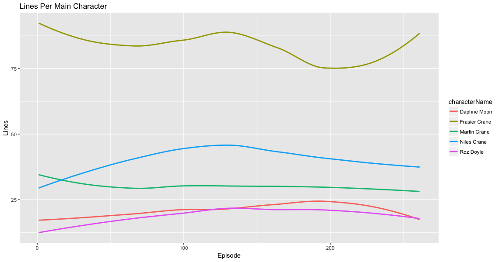
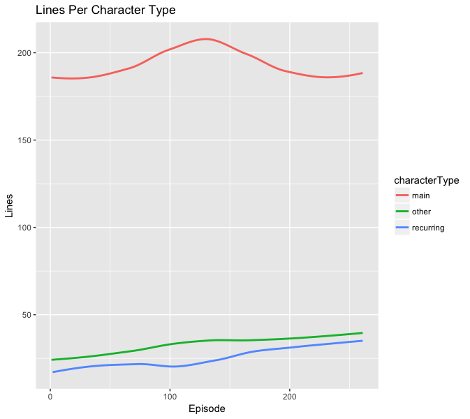
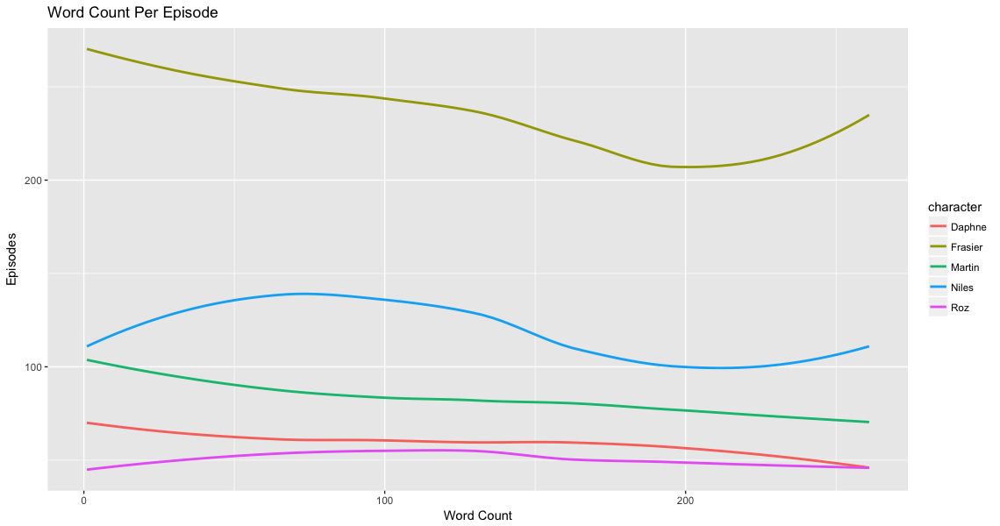
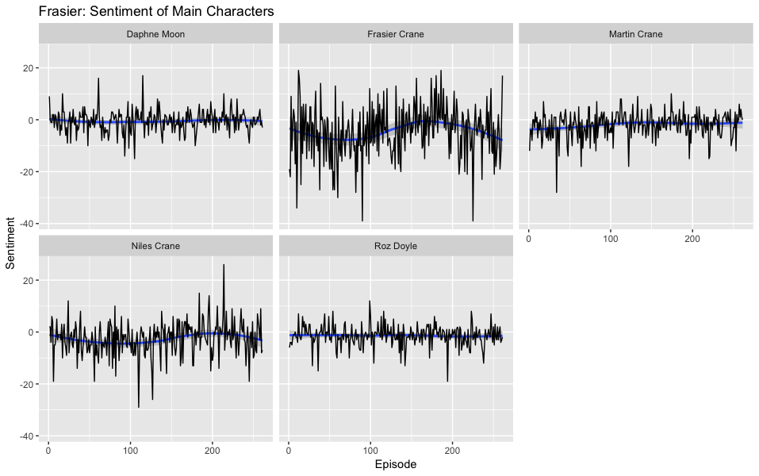

In this part of our analysis we will take a deeper dive of the 
television show Frasier.

If you've seen Frasier before, you know the the show is led by
main characters: Frasier Crane, is brother Niles Crane, his father
Martin Crane, his father's caregiver and Niles' future wife, Daphne
Crane and Frasier's coworker Roz Doyle.

Let's begin by taking a look at the line share of these main characters:

Overall `r characterTotals$characterName[characterTotals$percentTotal == max(characterTotals$percentTotal)]` carries `r paste0(round(characterTotals$percentTotal[characterTotals$percentTotal == max(characterTotals$percentTotal)], 2), "%")` of all lines, almost twice
as many as any other character on the show.

The line share of characters outside of the main five continued to grow
throughout the entire 11 seasons.

Since Frasier is the main character of the show and we've already seen that
he has the most lines of the show, does it make sense that he would also have
the most words per episode as well?

Like with the subtitle analysis, we'll also dive into a unigram sentiment analysis to
see which characters use the most positive and negative words in each episode.

It's interesting to see that Niles and Frasier follow a similiar linear trend in the
sentiment of their words. Frasier's largest use of negative words comes in episode 
`r episodeLow`: `r episodeLowName` where he directs an old-timey radio show that
turns into a disaster, while his largest uses of positive words comes in episode
`r episodeHigh`: `r episodeHighName` where Daphne and Niles elope in Las Vegas
and then stage a series of fake weddings.